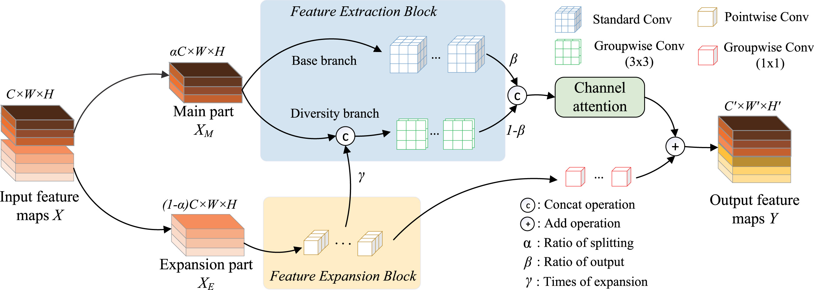

# BDRConv  
---
👨‍🔬 By Huihuang Zhang, Haigen Hu, Deming Zhou, Xiaoqin Zhang, Bin Cao

> Feature diversity and redundancy play a crucial role in enhancing a model’s performance, although their effect on network design remains underexplored. Herein, we introduce **BDRConv**, a compact convolutional neural network (CNN) module that establishes a balance between feature diversity and redundancy to generate and retain features with moderate redundancy and high diversity while reducing computational costs. Specifically, input features are divided into a main part and an expansion part. The main part extracts intrinsic and diverse features, while the expansion part enhances diverse information extraction. Experiments on the CIFAR10, ImageNet, and MS COCO datasets demonstrate that BDRConv-equipped networks outperform state-of-the-art methods in accuracy, with significantly lower floating-point operations (FLOPs) and parameters. In addition, **BDRConv** module as a plug-and-play component can easily replace existing convolution modules, offering potential for broader CNN applications.
<p align="center">
    
</p>
📄 This repository contains an official implementation of **BDRConv** for the NN paper [*Compact CNN module balancing between feature diversity and redundancy*](https://www.sciencedirect.com/science/article/pii/S0893608025003351).

---

### ⚙️ Environments

```
Python:     3.7.13  
PyTorch:    1.12.0+cu113  
Torchvision:0.13.0+cu113  
CUDA:       11.3  
CUDNN:      8.2  
NumPy:      1.21.5  
PIL:        9.0.1
```

---

### 🚀 Usage

BDRConv is designed to **replace any standard 3×3 convolutional layer** in existing CNN architectures. It is fully compatible with PyTorch and requires minimal changes to your codebase.

📌 **Example**: Replace a standard `nn.Conv2d(64, 128, kernel_size=3, stride=1, padding=1)` with BDRConv:

```python
from bdrconv import BDRConv

# Original Conv2d:
# conv = nn.Conv2d(64, 128, kernel_size=3, stride=1, padding=1)

# Replace with BDRConv:
bdr = BDRConv(inp=64, oup=128, kernel_size=1, dw_size=3, stride=1)
out = bdr(input_tensor)
```

📎 **Note**: You can flexibly adjust `in_ratio`, `out_ratio`, `exp`, and `reduction` according to model capacity and computational budget.

---

### 📚 Citation

If you find this repository useful, please consider citing the BDRConv paper:

```
@article{zhang2025compact,
  title={Compact CNN module balancing between feature diversity and redundancy},
  author={Zhang, Huihuang and Hu, Haigen and Zhou, Deming and Zhang, Xiaoqin and Cao, Bin},
  journal={Neural Networks},
  pages={107456},
  year={2025},
  publisher={Elsevier}
}
```

---
